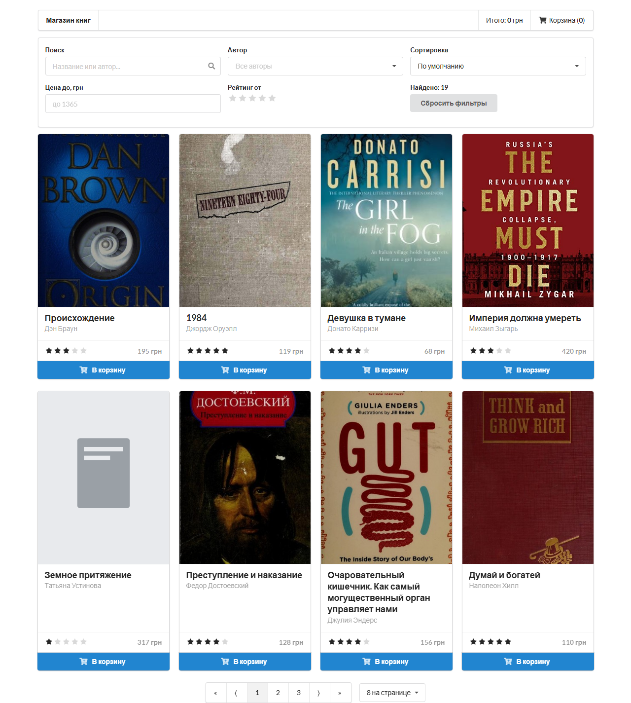
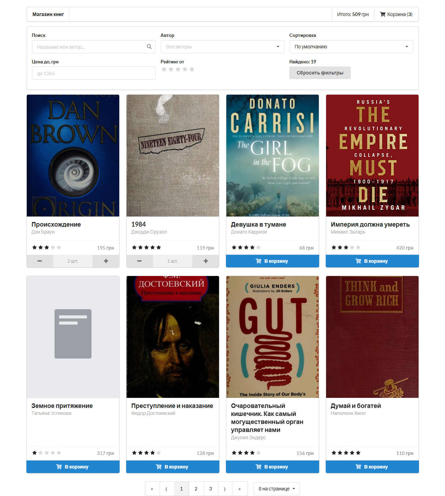
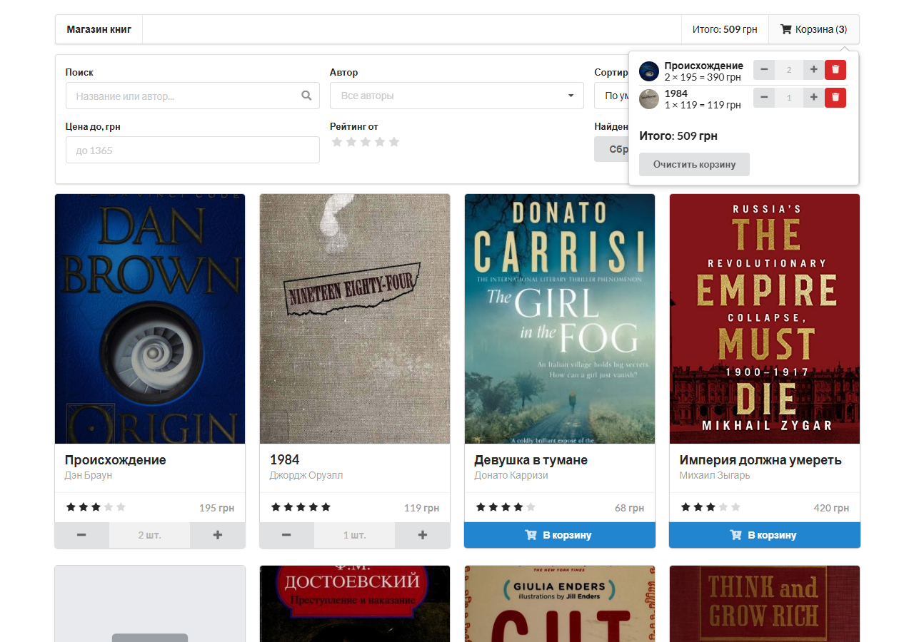
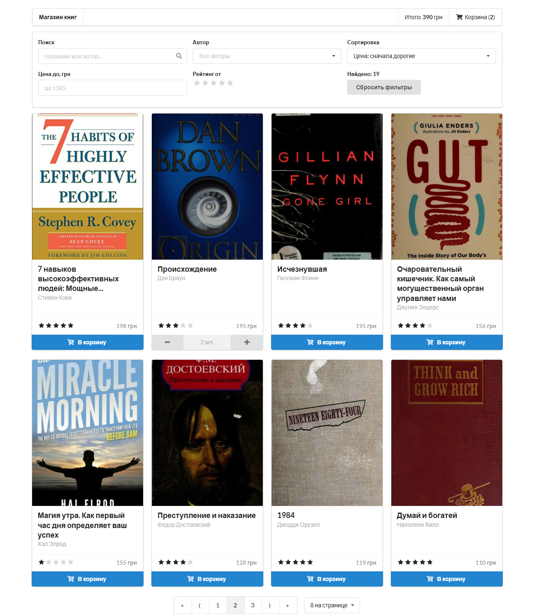
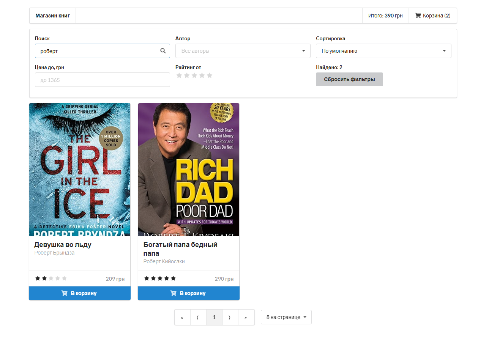
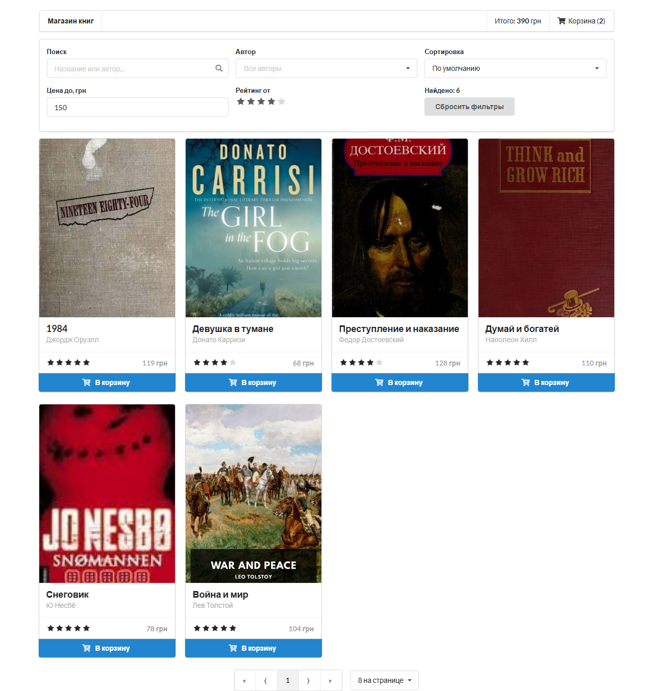
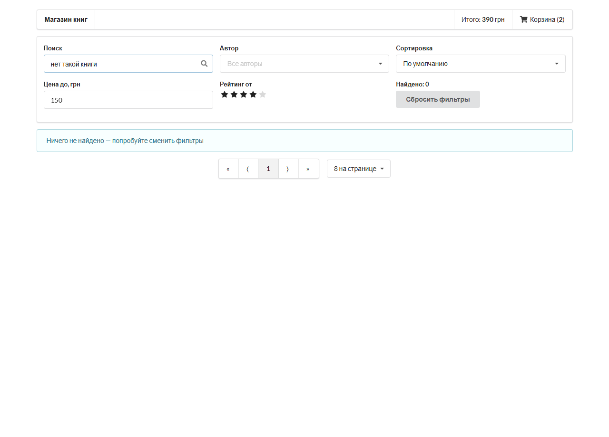

# Магазин книг

Учебный интернет-магазин: каталог, корзина, поиск, фильтры, сортировка и пагинация.

## Стек

| Что | Версия |
| --- | --- |
| React | 18 |
| TypeScript | 5 |
| Redux Toolkit + react-redux | 2 / 9 |
| Semantic UI React | 2 |
| Vite | 8 |
| Пакетный менеджер | **pnpm** |

Раньше проект жил на React 16, Redux 3, Webpack 3 (ejected CRA), Babel 6 и JS. Всё это заменено:
самописный webpack-конфиг выкинут в пользу Vite, `redux` + `redux-thunk` + `redux-logger` — на Redux Toolkit,
`axios` и `lodash` больше не нужны (`fetch` и нативные методы), `@material-ui` убран — хватает Semantic UI.

## Запуск

```bash
pnpm install
pnpm dev        # dev-сервер, http://localhost:5173
pnpm build      # проверка типов + сборка в ./build
pnpm preview    # раздать собранное, http://localhost:4173
pnpm typecheck  # только tsc
```

## Что умеет

- **Корзина поштучно.** На карточке кнопка «В корзину» превращается в «−  N шт.  +». В корзине (всплывающее окно в шапке)
  у каждой позиции те же `+` / `−`, кнопка удаления позиции целиком и очистка всей корзины; считается сумма по позициям и итог.
  Когда количество доходит до нуля, позиция пропадает.
- **Фильтрация:** поиск по названию/автору, выбор автора, цена «до», минимальный рейтинг, кнопка «Сбросить фильтры»,
  счётчик найденного и сообщение при пустой выдаче.
- **Сортировка:** по цене (↑/↓), рейтингу (↑/↓), автору, по умолчанию.
- **Пагинация:** по 4 / 8 / 12 товаров на странице; любое изменение фильтров или сортировки возвращает на 1-ю страницу.
- **Обложки.** Старые ссылки на внешние сайты (yakaboo, rozetka) массово протухли, поэтому обложки лежат локально в
  `public/covers/<id>.jpg`. Если файл не загрузился, подставляется `placeholder.svg`.

## Структура

```
src/
  main.tsx              точка входа
  types.ts              Book, CartItem, SortKey
  store/
    index.ts            configureStore + типизированные хуки
    booksSlice.ts       загрузка каталога (createAsyncThunk)
    cartSlice.ts        addOne / removeOne / removeAll / clear
    filterSlice.ts      поиск, фильтры, сортировка, страница
    selectors.ts        фильтрация → сортировка → пагинация, суммы корзины
  components/           App, Header (корзина), Filters, BookCard, Pager
public/
  books.json            каталог
  covers/               обложки
scripts/
  fetch-covers.mjs      разовая выгрузка обложек из Open Library
  make_screens.py       скриншоты приложения → docs/screens
docs/screens/           скриншоты для README
```

Фильтрация/сортировка/пагинация вынесены в мемоизированные селекторы (`reselect`), компоненты только рисуют.

## Скриншоты

**Каталог: первая страница, обложки загружаются локально**



**Карточка товара: «−» / «+» и счётчик штук**



**Корзина: количество по позициям, +/−, удаление, итог**



**Корзина после «−»: позиция с 1 шт. удалена**


**Сортировка: цена по убыванию**


**Пагинация: вторая страница**



**Поиск по названию/автору: «роберт»**



**Фильтры: цена до 150 грн и рейтинг от 4**



**Пустая выдача**



Пересобрать: `pnpm build && pnpm preview`, затем `pip install playwright && python scripts/make_screens.py`.

## Деплой

Firebase Hosting раздаёт папку `build` (см. `firebase.json`).
